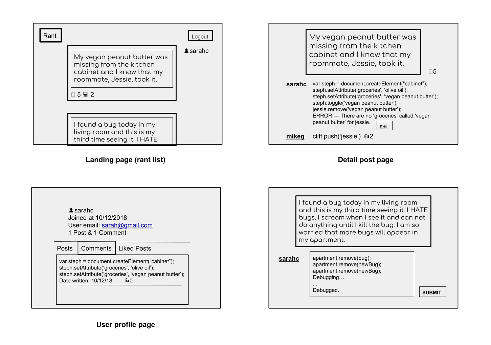
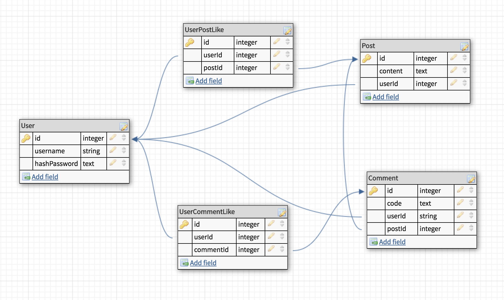

# Project #4 - Code the rant

- You can rant and code the rant that people posted. Your code will be posted like a comment on the rant post. There can be several code for one rant. The user can ‘like' the rant or the code. 
- My friend, Stephanie, told me that her vegan peanut butter was missing from the kitchen cabinet and she knows that her female roommate took it. When I heard the story it got me thinking….
``` 
var steph = document.createElement(“cabinet”);
steph.setAttribute(‘groceries', ‘olive oil’);
steph.setAttribute(‘groceries', ‘vegan peanut butter’);
steph.toggle(‘vegan peanut butter’);
jessie.remove('vegan peanut butter’);
ERROR — There are no ‘groceries’ called 'vegan peanut butter’ for jessie. 
```


## Wireframes


## ERD
